# ¿Cómo contrata la Alcaldía de Barrancabermeja?

*Lo que muestran los contratos publicados en SECOP II entre abril de 2021 y el 4 de septiembre de 2026, contado de lo general a lo particular.*

> **La gran idea.** La Alcaldía contrata a miles de personas con contratos cortos que se firman en oleadas que coinciden con el calendario del presupuesto y de las elecciones. Las personas encadenan contratos con pausas de semanas entre uno y otro, y con el cambio de gobierno 6 de cada 10 contratistas no volvieron a tener CPS con la Alcaldía.

- **26.128** CPS con personas firmados desde abril de 2021
- **8.663** personas distintas contratadas
- **94 % / 17 %** de los contratos / del valor son CPS (mediana anual)
- **47 días** espera típica entre un contrato y el siguiente (mediana)
- **28–39 %** de las personas suma 7 meses o más de contrato al año
- **525** personas con CPS todos los años de 2022 a 2025

## Conozca a Ana, la contratista típica

> Llamémosla Ana. No existe: está armada con los valores típicos (medianas y promedios) de miles de contratistas. En 2025 firmó 1,4 contratos en promedio con la Alcaldía, cada uno de unos 3,3 meses. Sumó 4,0 meses con contrato en el año. Cuando uno terminó, esperó alrededor de 34 días por el siguiente (y tuvo 74 % de probabilidad de tenerlo antes de tres meses). Si es profesional, pactó unos 4,0 millones al mes; si es de apoyo a la gestión, 2,5 millones. En todo el año sumó cerca de 14,0 millones de pesos en contratos. En enero, como casi todos, no tuvo contrato.

Esta historia recorre 27.909 contratos de la Alcaldía central (NIT 890201900), 26.128 de ellos contratos de prestación de servicios (CPS) con 8.663 personas, durante el final del gobierno de Alfonso Eljach (desde abril de 2021) y el de Jonathan Vásquez (desde enero de 2024). No describe empleos de planta, salarios ni pagos: describe lo que se pactó al firmar. Ninguna persona contratista se identifica.

- **Dato descriptivo:** conteo o suma de un universo validado.
- **Patrón estadístico:** regularidad que se repite en el tiempo o entre grupos.
- **Anomalía que requiere documentos:** algo que SECOP muestra pero solo un expediente explica; aquí va como pregunta.
- **Qué no significa:** cada hallazgo dice qué conclusión no se puede sacar de él.

## Acto 1 · El tamaño

Primero, la escala: cuántos contratos, cuántas personas y cuánto dinero maneja cada alcalde.

### ¿Cuántos contratos firma cada alcalde y cuántos son con personas?

**Nueve de cada diez contratos son CPS con personas.** En los 33 meses observados del gobierno de Alfonso Eljach (abr-2021 a dic-2023) la Alcaldía central firmó 13.669 contratos; 12.755 fueron CPS con 4.986 personas distintas (386 CPS al mes). En los 32 meses de Jonathan Vásquez (ene-2024 al corte) firmó 14.240 contratos; 13.373 CPS con 5.256 personas (416 al mes). Los dos periodos no son la misma etapa del mandato, así que la comparación justa es el año 3 (enero–agosto de 2022 y de 2026): 3.378 CPS con 2.819 personas con Alfonso y 4.133 con 3.123 con Jonathan. La dirección (más CPS y más personas en el periodo de Jonathan) se mantiene con todas las ventanas del cuaderno 04, pero el tamaño del aumento cambia según la ventana: de +10,8 % a +26,5 % en personas y de +22,4 % a +25,4 % en contratos.

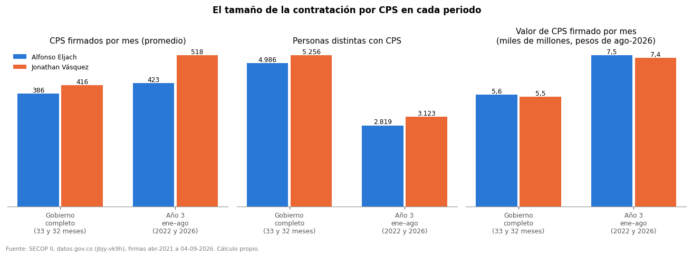

> **Qué no significa:** Más contratos no significa más empleo ni mejor gestión: un mismo trabajo puede partirse en varios contratos cortos. Los gobiernos están en etapas distintas del mandato; por eso se comparan ventanas equivalentes.

Dato descriptivo · publicable · universo: Contratos válidos de la Alcaldía central (NIT 890201900); CPS de personas con identidad apta · límite: El periodo de Alfonso empieza en abril de 2021 (sin verificación externa en esta ejecución (el 01 no pudo consultar SECOP I); abril de 2021 es el primer mes con registro pleno en SECOP II). · tabla: p01_nueve_de_cada_diez_contratos_son_cps_con.csv

### ¿Cuánto dinero es y qué parte se va en CPS?

**Muchos contratos, poca plata.** Cada año entre 92 % y 95 % de los contratos son CPS, pero se llevan entre 13 % y 31 % del valor firmado. En todo el gobierno observado de Alfonso los CPS sumaron 183,7 miles de millones de pesos constantes (5,6 al mes) y en el de Jonathan 175,9 (5,5 al mes). El resto del dinero va a obras, convenios, bienes y servicios de empresas (Acto 6).

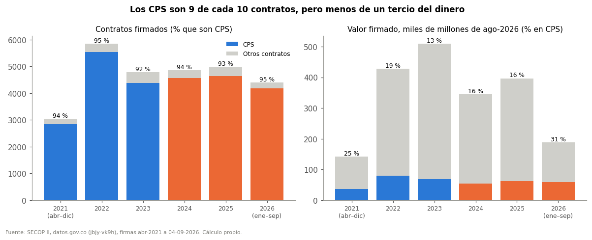

> **Qué no significa:** Es valor pactado al firmar, no pagado. Un año con mucha obra hace que los CPS pesen menos en porcentaje.

Dato descriptivo · publicable · universo: Contratos válidos de la Alcaldía central · límite: 2021 y el año del corte son parciales; el valor de los meses sin IPC publicado queda fuera de las sumas. · tabla: p02_muchos_contratos_poca_plata.csv

## Acto 2 · La vida de un contratista

Detrás de los totales hay personas que encadenan contratos cortos, con pausas entre uno y otro.

### ¿Cuánto dura un contrato? ¿Cuántos pasan de 6 o 7 meses?

**Contratos cortos.** Un CPS dura en promedio 3,7 meses con Alfonso y 3,5 con Jonathan (mediana 3,9 y 3,0). Los contratos de 6 meses o más son la excepción: 1.052 (8,3 %) con Alfonso y 499 (3,8 %) con Jonathan; de 7 meses o más, 419 y 169. De los de 7 meses o más de Alfonso, 385 se firmaron en 2023 (el 9 % de los CPS de ese año, el último del gobierno): esa tanda explica casi toda la diferencia. En la ventana comparable (enero–agosto del año 3) los de 7 meses o más fueron 0,4 % y 0,3 %, y los de 6 meses o más 1,0 % y 2,5 %: no hay una diferencia de fondo entre gobiernos. En los años completos solo entre el 0,1 % y el 0,2 % de los CPS termina después del 31 de diciembre del año en que se firmó.

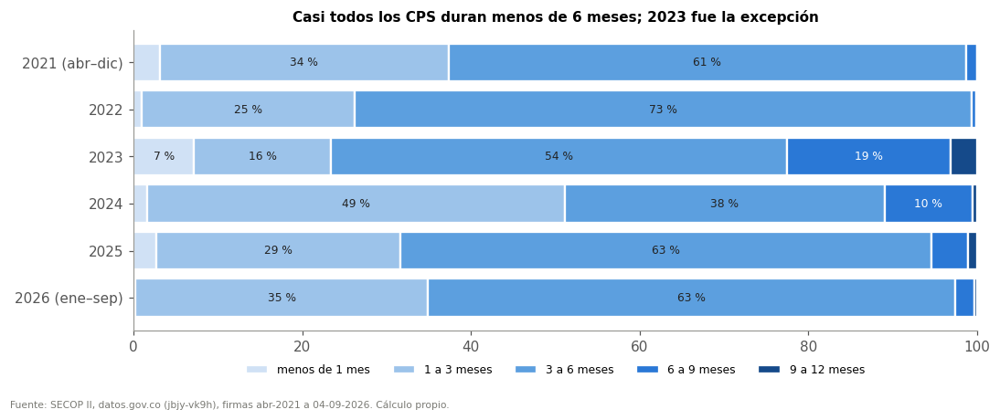

> **Qué no significa:** Un contrato corto no implica un servicio mal prestado. El dato no dice por qué se pactan así (presupuesto anual, planeación u otras razones).

Dato descriptivo · publicable · universo: CPS de personas, Alcaldía central, vigencia 1–366 días · límite: Vigencia pactada registrada (ya incluye prórrogas), no días trabajados. · tabla: p03_contratos_cortos.csv

### ¿Cuántas personas son "las más estables" (7 meses o más con contrato en el año)?

**Contratos cortos, personas que encadenan.** Aunque pocos contratos pasan de 7 meses, muchas personas suman 7 meses o más con contrato en el año encadenando varios: 2022: 1.186 personas (34 %); 2023: 1.198 personas (39 %); 2024: 801 personas (30 %); 2025: 921 personas (28 %). Con 10 meses o más, casi todo el año, solo entre 6 % y 9 %. La persona típica tuvo contrato entre 4,0 y 5,7 meses del año y firmó en promedio 1,4 a 1,7 contratos. 2022 y 2023 son los años 3 y 4 de Alfonso; 2024 y 2025, los años 1 y 2 de Jonathan.

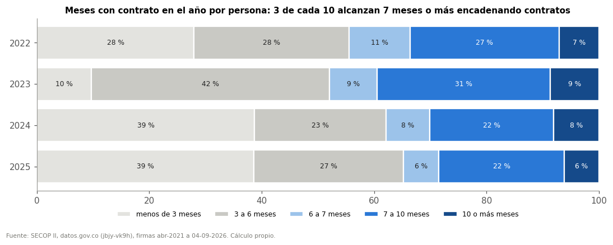

> **Qué no significa:** No mide ingresos anuales ni empleo: fuera de la Alcaldía la persona puede tener otros trabajos.

Patrón estadístico · publicable con cautela · universo: CPS de personas, Alcaldía central, años calendario completos · límite: Etapas distintas del mandato; fechas pactadas, no días trabajados. · tabla: p04_contratos_cortos_personas_que_encadenan.csv

### ¿Cuáles son los contratos más largos que dio cada alcalde?

**Ningún CPS válido llega a un año.** El CPS más largo del gobierno de Alfonso duró 11,4 meses y el de Jonathan 10,6. Con Alfonso hubo 140 CPS de 9 meses o más (74 de 10 o más); con Jonathan, 86 (28). En el año 3 (enero–agosto) fueron 4 y 12. De los CPS de 9 meses o más, tuvieron prórroga el 24 % con Alfonso y el 48 % con Jonathan. Además, 1 CPS con más de 366 días de vigencia registrada se deja fuera de estos cálculos por ser probable error de registro (sigue en la base).

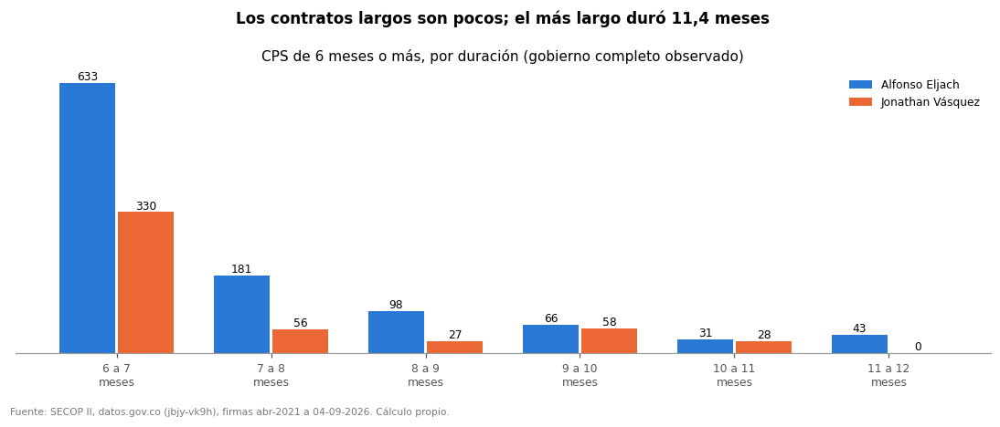

> **Qué no significa:** Un contrato largo no es un privilegio ni un empleo: sigue siendo un CPS. La lista con nombres queda para verificación interna.

Dato descriptivo · publicable · universo: CPS de personas, Alcaldía central, vigencia 1–366 días · límite: Se publican conteos por banda de duración; la lista de contratos queda para verificación interna. · tabla: p05_ningun_cps_valido_llega_a_un_ano.csv

### Cuando se acaba un contrato, ¿cuánto tarda la renovación?

**Mes y medio de espera típica.** Entre quienes vuelven a tener un CPS con la Alcaldía en menos de un año, la espera promedio es de 72 días (2,4 meses) y la mediana de 47 días: la mitad espera menos de mes y medio. Pero cuántos renuevan depende mucho del año: antes de 90 días volvió a tener contrato entre el 40 % (finales de 2022) y el 75 % (finales de 2021). Esa variación entre años es mayor que la diferencia entre gobiernos, por eso no se compara a los alcaldes con este indicador. En el cambio de gobierno solo el 39 % volvió dentro del año. Quien termina en diciembre espera una mediana de 56 días: el vacío de enero.

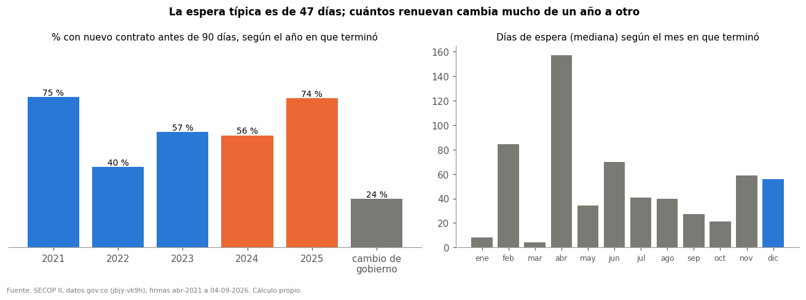

> **Qué no significa:** Esperar no significa estar desempleado: la persona puede trabajar en otra parte. No renovar no es despido.

Patrón estadístico · publicable con cautela · universo: Episodios de CPS de la Alcaldía central terminados al menos 365 días antes del corte · límite: Seguimiento igual de 365 días; solo ve la Alcaldía central. El Q04 del 06 mide pausas dentro de una ventana (otra definición) y da cifras distintas. · tabla: p06_mes_y_medio_de_espera_tipica.csv

### ¿Cuántas personas tienen contrato vigente cada día?

**Cada enero la contratación se apaga.** En un día cualquiera de los años completos había en promedio entre 1.124 y 1.661 personas con CPS vigente, con picos de hasta 2.737 (3.013 en 2026). Pero el 15 de enero de 2022 a 2025 había entre 1 y 4 personas: cada año hubo entre 19 y 24 días con menos de 100 contratistas. 2026 rompe el patrón: el 15 de enero ya había 757. Coincide con que ese año los CPS empezaron a firmarse antes: la primera tanda de enero (10 o más CPS en un día) llegó el 5 de enero, frente al 15–18 de enero de los años completos (Acto 5).

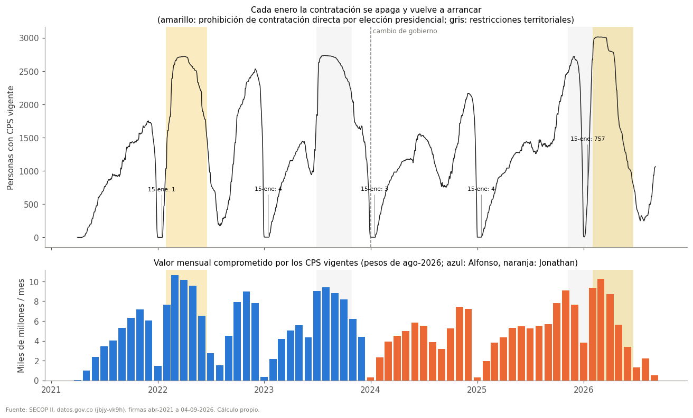

> **Qué no significa:** No significa que los servicios se suspendan ni que las personas queden sin ingresos: describe la vigencia pactada de los CPS.

Patrón estadístico · publicable con cautela · universo: CPS de personas, Alcaldía central, vigencia 1–366 días · límite: Fechas pactadas; una terminación anticipada no registrada infla la vigencia. · tabla: p07_cada_enero_la_contratacion_se_apaga.csv

### ¿Qué tan frecuentes son las prórrogas?

**Las prórrogas se volvieron frecuentes.** El porcentaje de CPS con días adicionados pasó de 2 % en 2022 a 31 % en 2026 (hasta el corte), con una prórroga mediana de 32 días. En 2026 casi todas son de contratos firmados en enero, antes de la Ley de Garantías (Acto 5).

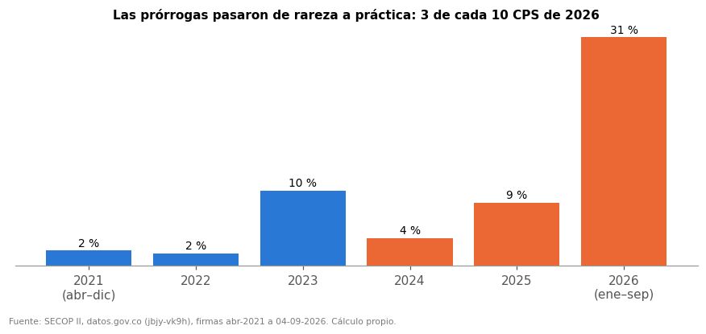

> **Qué no significa:** Prorrogar está previsto en la ley y el dato no evalúa cada prórroga. Lo que cambia es la forma de contratar: más extensiones de contratos vigentes.

Patrón estadístico · publicable con cautela · universo: CPS de personas, Alcaldía central · límite: Los contratos de 2026 siguen en ejecución y pueden sumar más prórrogas. · tabla: p08_las_prorrogas_se_volvieron_frecuentes.csv

## Acto 3 · El dinero en el bolsillo

Cuánto se pacta al mes, cómo cambia con la inflación y el salario mínimo, y cómo se reparte.

### ¿Cuánto pacta al mes un profesional y un apoyo a la gestión con cada alcalde?

**Más pesos, menos poder de compra con el paso del tiempo.** En pesos de cada año, con Alfonso (abr-2021 a dic-2023) un CPS profesional pactó en promedio 3,72 millones al mes (mediana 3,51) y uno de apoyo a la gestión 2,07 (mediana 2,00). Con Jonathan (ene-2024 al corte): profesional 4,25 (mediana 4,02) y apoyo 2,60 (mediana 2,54). En pesos de cada año las cifras incluyen el efecto de la inflación. Descontando la inflación, la mediana profesional pasó de 5,1 millones en 2021 a 4,2 en 2026 (pesos de agosto de 2026), y en salarios mínimos de 3,8 a 2,3: los honorarios crecieron menos que la inflación y mucho menos que el salario mínimo. La caída empezó en 2022 y 2023, tuvo un repunte en 2024 y siguió después, así que no se atribuye a un alcalde (el 06 marca esa comparación como no publicable). En apoyo a la gestión la mediana real cambió -9,7 % entre 2021 y 2026, o -9,7 % si los contratos de subtipo ambiguo se cuentan como apoyo: la magnitud depende del clasificador.

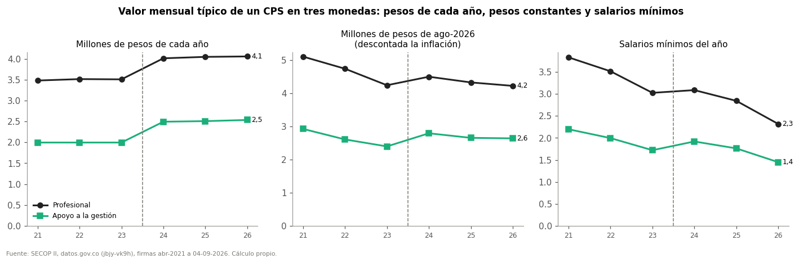

> **Qué no significa:** No es salario ni ingreso: no descuenta aportes ni cuenta los meses sin contrato. No dice si un gobierno paga más o menos que otro.

Dato descriptivo · publicable con cautela · universo: CPS de personas con 30 días o más y subtipo claro, Alcaldía central · límite: El subtipo profesional/apoyo sale del texto del contrato (SIN_VALIDACION_MANUAL). IPC nacional. · tabla: p09_mas_pesos_menos_poder_de_compra_con_el_p.csv

### A la misma persona, ¿le cambió el valor mensual?

**Para la misma persona, el resultado depende de cuándo se mida.** De las 775 personas con CPS profesional en ambos gobiernos, al comparar su último contrato con Alfonso y su primero con Jonathan (una mediana de 12 meses después), el valor mensual subió +11,9 % en pesos de cada año y +0,7 % descontando la inflación (mediana), pero el 48 % perdió poder de compra. Si la misma persona se compara con cuatro años de distancia (enero–agosto de 2022 frente a 2026, cuaderno 04), la mediana real profesional cae -12,6 % y solo el 21 % tuvo aumento. En apoyo a la gestión: +8,7 % real en el cambio de gobierno y +1,2 % entre 2022 y 2026. La lectura consistente es la de la serie (P09): los valores reales se erosionan con el tiempo, con un repunte puntual en el cambio de gobierno.

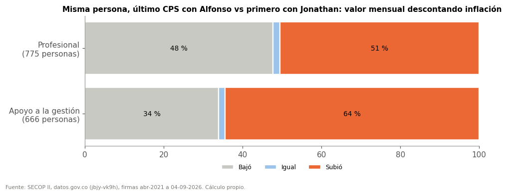

> **Qué no significa:** No es un aumento ni un recorte de sueldo: el objeto del contrato puede cambiar y entre un contrato y otro pasa tiempo. No permite decir que un alcalde pague más o menos.

Patrón estadístico · publicable con cautela · universo: Personas con CPS del mismo subtipo en ambos gobiernos, 30 días o más · límite: Subtipo por texto (SIN_VALIDACION_MANUAL); el resultado cambia con el intervalo de tiempo entre contratos. · tabla: p10_para_la_misma_persona_el_resultado_depen.csv

### ¿Cómo se reparte el dinero de los CPS entre las personas?

**Sin concentración extrema.** En los años completos, el 10 % de las personas con más valor contratado reunió entre 25 % y 28 % del total, y la mitad con menos valor entre 19 % y 23 % (índice de Gini 0,38–0,43): hay desigualdad moderada, sin un grupo pequeño que concentre la mayor parte. En un año completo, una persona sumó en promedio entre 19,2 y 22,5 millones de pesos constantes en CPS (mediana 14,0–18,0); el 10 % superior pasó de 42,7 millones.

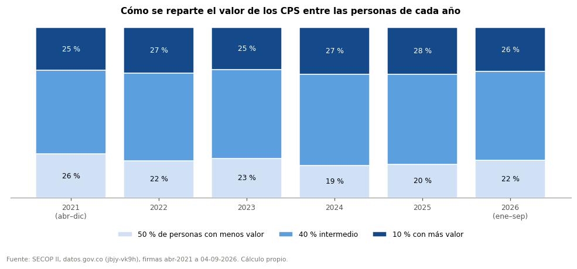

> **Qué no significa:** No mide ingresos totales: una persona puede tener otros contratos, empleos o fuentes.

Dato descriptivo · publicable · universo: CPS de personas, Alcaldía central, valor con IPC publicado · límite: Valor pactado al firmar, no pagado. · tabla: p11_sin_concentracion_extrema.csv

## Acto 4 · Varias puertas

Muchas personas no solo contratan con la Alcaldía: también con entidades del Distrito o autónomas.

### ¿Cuántas personas han contratado con la Alcaldía y también con otras entidades?

**15 % de los contratistas de la Alcaldía también tuvo CPS en otra entidad.** De las 8.663 personas con CPS en la Alcaldía central desde abril de 2021, 1.281 (15 %) también tuvieron CPS con otra entidad en algún momento: 631 con el Concejo, 323 con INDERBA, 163 con EDUBA, 140 con la Personería y 127 con Tránsito. 188 de ellas pasaron por tres o más entidades. Aparte, 397 contratistas de la Alcaldía aparecen en registros de servicios personales de la ESE que aún no se confirman como CPS. Cada entidad empezó a publicar con regularidad en SECOP II en un mes distinto (entre 2021-04 y 2025-07), por eso no se comparan gobiernos con este dato.

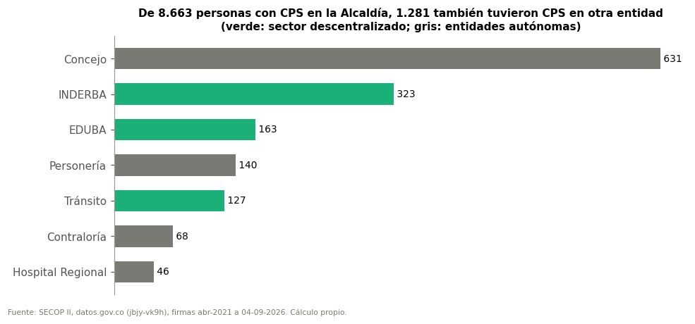

> **Qué no significa:** Contratar con dos entidades no es irregular: casi siempre son contratos en momentos distintos. Si hubo contratos al mismo tiempo se revisa en el 05 y requiere expedientes. El Concejo, la Personería y la Contraloría no dependen del alcalde.

Dato descriptivo · publicable con cautela · universo: CPS de personas naturales con identidad apta en las nueve entidades · límite: Cobertura de SECOP II distinta por entidad; combinaciones con menos de 10 personas no se muestran. · tabla: p12_15_de_los_contratistas_de_la_alcaldia_ta.csv

### ¿Cómo contratan las otras entidades?

**Las otras entidades crecen en SECOP II.** INDERBA firmó entre 370 y 583 contratos por año completo; el Concejo, entre 269 y 304. La ESE pasó de 105 contratos en 2022 a 798 en 2025, y el Hospital Regional aparece solo desde 2025. Esos saltos pueden reflejar, al menos en parte, que las entidades empezaron a publicar en SECOP II; no se puede leer como más contratación sin revisar SECOP I.

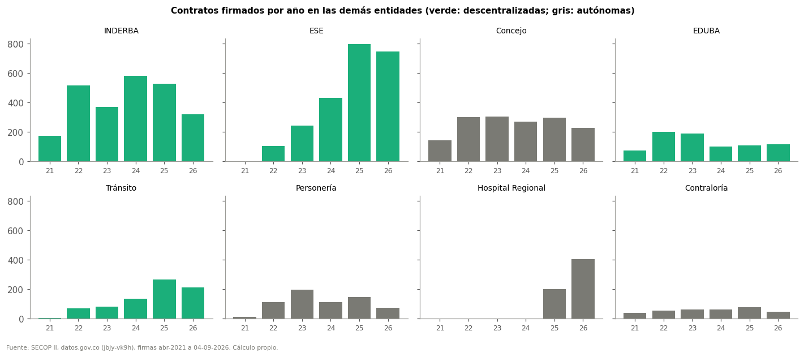

> **Qué no significa:** No se suman al alcalde las entidades autónomas. Los cambios de publicación impiden comparar gobiernos en estas entidades.

Dato descriptivo · publicable con cautela · universo: Contratos válidos de las nueve entidades · límite: Cobertura de SECOP II distinta por entidad y año. · tabla: p13_las_otras_entidades_crecen_en_secop_ii.csv

## Acto 5 · El reloj político

El ritmo de firmas coincide con el calendario del presupuesto y de las elecciones, y en el cambio de gobierno la mayoría de contratistas no siguió.

### ¿Cuándo se firman los contratos?

**La contratación llega en oleadas y en pocos días.** Los CPS se firman en tandas. Según el año, los 10 días con más firmas concentraron entre 16 % y 42 % de todos los CPS del año. El día de más firmas fue el 2 de febrero de 2022 (miércoles), con 541 CPS. Hay tandas en fin de semana: 206 CPS en sábados y domingos de enero de 2022; 336 CPS en sábados y domingos de junio de 2023; 625 CPS en sábados y domingos de enero de 2026. Y hay meses casi vacíos: en los meses calendario de julio a octubre de 2023 se firmaron 6 CPS en total.

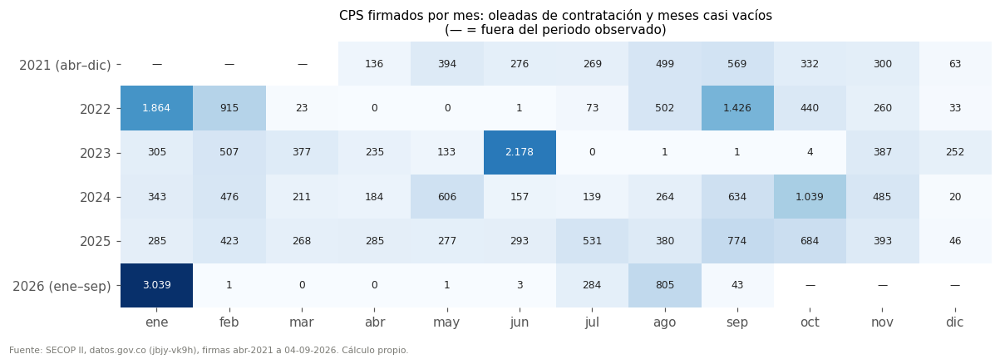

> **Qué no significa:** Firmar en tanda no es ilegal ni prueba de nada: puede reflejar la planeación del año o la llegada de recursos. La fecha registrada en SECOP II puede no coincidir con la de suscripción del documento.

Patrón estadístico · publicable con cautela · universo: CPS de personas naturales, Alcaldía central · límite: Fecha de firma registrada en SECOP II; no se verificó contra el documento físico. · tabla: p14_la_contratacion_llega_en_oleadas_y_en_po.csv

### ¿Qué pasó con la contratación antes de la Ley de Garantías de 2026?

**2026: contratar antes de la veda y luego prorrogar.** Entre el 1 de enero y el 30 de enero de 2026 la Alcaldía firmó 3.039 CPS; 1.135 de ellos en los 10 días previos a la prohibición, 189 en sábado o domingo. Durante la prohibición (31 de enero de 2026 a 21 de junio de 2026) SECOP registra 2 CPS. El 42 % de los CPS de enero se prorrogó: el 98 % de esos contratos terminaba antes del fin de la veda y, con la prórroga, el 75 % quedó terminando en la última quincena de la veda o después. Según Colombia Compra Eficiente (Circular 006), la prohibición no cobija las prórrogas y adiciones de contratos vigentes.

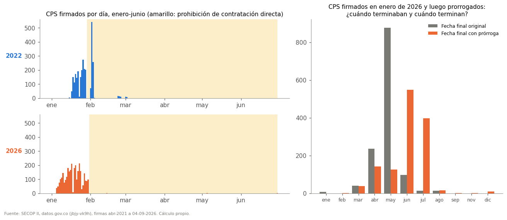

> **Qué no significa:** No prueba una irregularidad. Si alguna prórroga se usó para eludir la restricción, solo lo muestran los expedientes. El dato muestra que el ritmo de firmas coincide con el calendario electoral, no por qué.

Patrón estadístico · publicable con cautela · universo: CPS de personas naturales, Alcaldía central · límite: La fecha final original se estima restando los días adicionados; los contratos de 2026 siguen en ejecución. · tabla: p15_2026_contratar_antes_de_la_veda_y_luego.csv

### ¿Se firmaron CPS durante los periodos de prohibición de la Ley de Garantías?

**CPS con fecha de firma dentro de los periodos de prohibición.** El artículo 33 de la Ley 996 de 2005 prohíbe la contratación directa en los cuatro meses previos a la elección presidencial. Con fecha de firma entre el 29 de enero de 2022 y el 19 de junio de 2022, SECOP II registra 938 CPS de la Alcaldía central: 874 en la primera semana y 24 después del primer mes. En el periodo equivalente de 2026 (31 de enero de 2026 a 21 de junio de 2026) registra 2. El cuaderno 05 cuenta 939 y 2 (incluye CPS sin identidad apta).

> **Qué no significa:** No es una conclusión legal. La ley exceptúa, entre otros, lo relacionado con defensa y seguridad del Estado, crédito público, emergencias educativas, sanitarias y desastres, y la contratación de entidades sanitarias y hospitalarias; además, la fecha de firma de SECOP II puede no ser la de suscripción. Si hubo infracción solo lo dicen los expedientes.

Dato descriptivo · publicable con cautela · universo: CPS de personas naturales, Alcaldía central · límite: Conteo por fecha de firma registrada; la legalidad de cada contrato requiere su expediente. · tabla: p16_cps_con_fecha_de_firma_dentro_de_los_per.csv

### ¿Qué pasó antes de las elecciones locales de 2023?

**Junio de 2023: la tanda antes de las elecciones locales.** En los 30 días previos al 29 de junio de 2023 (inicio de las restricciones territoriales por las elecciones del 29 de octubre de 2023) la Alcaldía firmó 2.187 CPS (en las mismas fechas de 2024 y 2025, 324 en promedio), 336 de ellos en sábado o domingo. Su duración mediana fue de 5,0 meses y el 48 % termina en diciembre de 2023, el último mes del gobierno. Las personas con CPS vigente pasaron de 1.178 un mes antes a 2.737 el 28 de julio de 2023 (P07). Durante las restricciones territoriales (29 de junio de 2023 a 29 de octubre de 2023) se firmaron apenas 5 CPS, aunque esas restricciones no prohíben contratar CPS.

> **Qué no significa:** Las restricciones territoriales no prohíben contratar CPS; no hay base para afirmar uso electoral. Es una coincidencia de calendario que merece explicación de la administración.

Patrón estadístico · publicable con cautela · universo: CPS de personas naturales, Alcaldía central · límite: Sin expedientes no se conoce el motivo de la tanda (presupuesto, proyectos, vigencias). · tabla: p17_junio_de_2023_la_tanda_antes_de_las_elec.csv

### ¿Se firmaron contratos interadministrativos durante la restricción de 2025–2026?

**Contratos interadministrativos con fecha de firma dentro de la restricción del artículo 38.** El parágrafo del artículo 38 de la Ley 996 prohíbe a los alcaldes celebrar convenios interadministrativos para ejecutar recursos en los cuatro meses previos a las elecciones; en este ciclo, del 8 de noviembre de 2025 al 21 de junio de 2026. Con fecha de firma en ese periodo, SECOP II registra 6 contratos o convenios interadministrativos de la Alcaldía central (del 26 de diciembre de 2025 al 30 de enero de 2026), por 15,5 miles de millones de pesos corrientes. Después de la restricción y hasta el corte se firmaron 5 más.

> **Qué no significa:** No es una conclusión legal: la prohibición recae sobre convenios que ejecutan recursos, hay discusión jurídica sobre los contratos interadministrativos y la categoría de SECOP II no basta para clasificarlos. Solo el expediente lo aclara.

Dato descriptivo · publicable con cautela · universo: Contratos válidos de la Alcaldía central con justificación interadministrativa · límite: Conteo por fecha de firma registrada; requiere expediente y concepto jurídico de cada contrato. · tabla: p18_contratos_interadministrativos_con_fecha.csv

### Con el cambio de gobierno, ¿quién siguió?

**El nuevo gobierno volvió a contratar a 4 de cada 10 contratistas del anterior.** Al final del gobierno anterior (oct–dic 2023) 2.709 personas tenían CPS vigente. El nuevo gobierno volvió a contratar al 40 % hasta el corte, pero solo al 16 % en el primer trimestre de 2024. Quienes regresaron pasaron una mediana de 160 días sin contrato. En 2024, el 44 % de las personas contratadas venía del gobierno anterior. En total, 1.579 personas tuvieron CPS con ambos gobiernos.

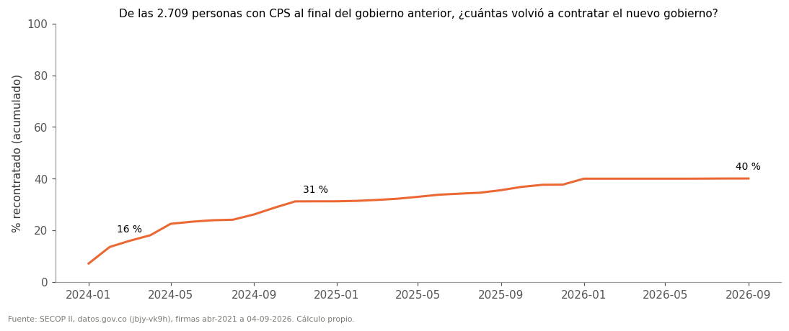

> **Qué no significa:** No mide despidos (un CPS termina en su fecha) ni persecución o favoritismo: el nuevo gobierno puede tener otros programas y necesidades.

Patrón estadístico · publicable con cautela · universo: CPS de personas naturales, Alcaldía central, vigencia 1–366 días · límite: Solo ve la Alcaldía central: una persona pudo pasar a otra entidad. · tabla: p19_el_nuevo_gobierno_volvio_a_contratar_a_4.csv

### ¿Cuántos son nuevos cada año y cuántos siguen?

**Dentro de un gobierno la mayoría repite; en el cambio, la mayoría no.** Dentro de un mismo gobierno, entre el 57 % y el 79 % de las personas con CPS en un año vuelve a tener CPS al año siguiente. En el paso 2023→2024 repitió el 30 %. Visto desde el otro lado: en 2024 el 66 % de las personas contratadas no había tenido CPS el año anterior, frente a entre 34 % y 49 % en los demás años completos.

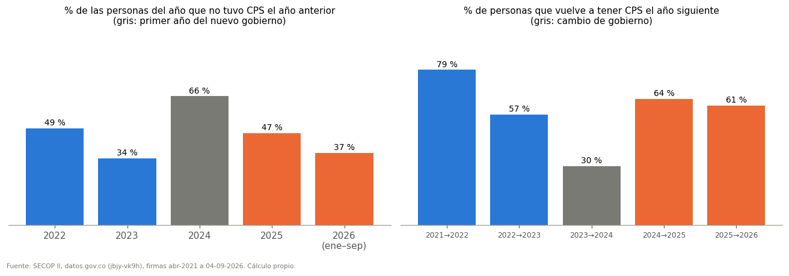

> **Qué no significa:** Repetir no es favoritismo ni salir es despido. Quien no aparece pudo contratar con otra entidad o en SECOP I.

Patrón estadístico · publicable con cautela · universo: CPS de personas naturales, Alcaldía central · límite: 2021 empieza en abril y 2026 es parcial: el paso 2025→2026 es un mínimo. · tabla: p20_dentro_de_un_gobierno_la_mayoria_repite.csv

## Acto 6 · Más allá de las personas

Dónde se contrata y en qué se va el resto del dinero: dependencias, obras y convenios.

### ¿Qué dependencias contratan más CPS?

**Qué dependencias contratan y cómo cambió.** Donde el objeto del contrato nombra la dependencia (36–63 % de los CPS según el año), las que más CPS concentran en el gobierno actual son Educación, Interior, Seguridad y convivencia. Frente al gobierno anterior, las que más ganaron participación son Seguridad y convivencia (+6,8 puntos) y Infraestructura (+3,2); las que más perdieron, Interior (-5,2) y Talento humano (-4,3). Algunas dependencias dejan de aparecer en 2026, lo que sugiere cambios de nombre o de estructura administrativa.

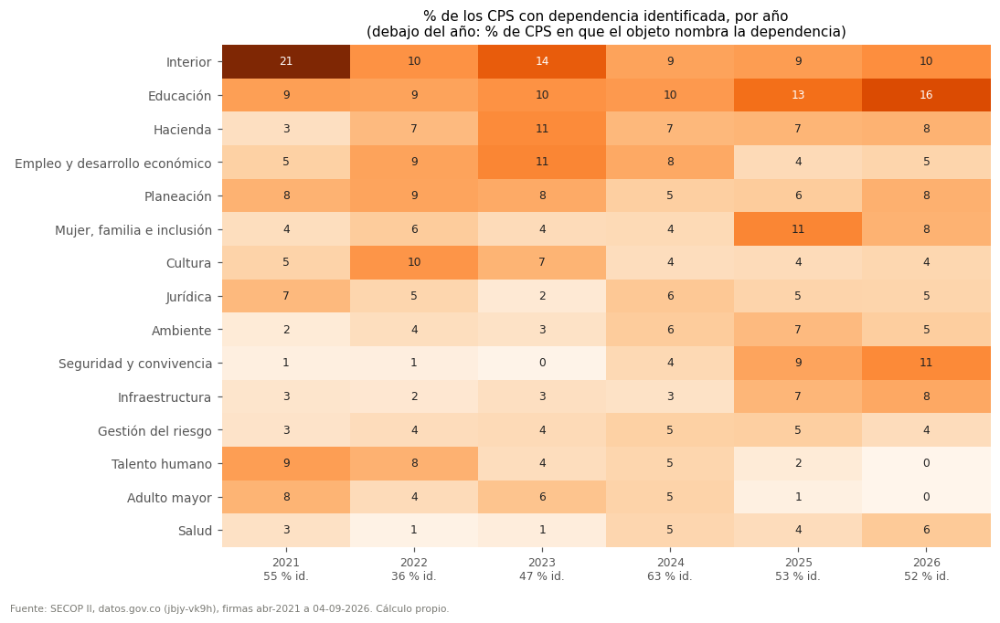

> **Qué no significa:** Solo describe los contratos cuyo objeto nombra la dependencia; el resto no se asigna. No muestra el presupuesto de cada secretaría.

Patrón estadístico · publicable con cautela · universo: CPS de personas naturales, Alcaldía central, con dependencia en el objeto · límite: Extracción por texto; la cobertura cambia por año y puede sesgar las participaciones. · tabla: p21_que_dependencias_contratan_y_como_cambio.csv

### ¿En qué años se firma la obra pública?

**La obra pública se firmó sobre todo al final del gobierno anterior.** El valor firmado en contratos de obra fue de 71,5 miles de millones en 2022 y 198,4 en 2023, el último año del gobierno anterior; en 2024, primer año del nuevo gobierno, 3,2, y en 2025 18,2 (pesos constantes). La interventoría sigue el mismo ciclo. Coincide con lo que se espera del ciclo de un gobierno local (planear al comienzo, contratar obra al final), pero con un solo periodo por lado no se puede generalizar.

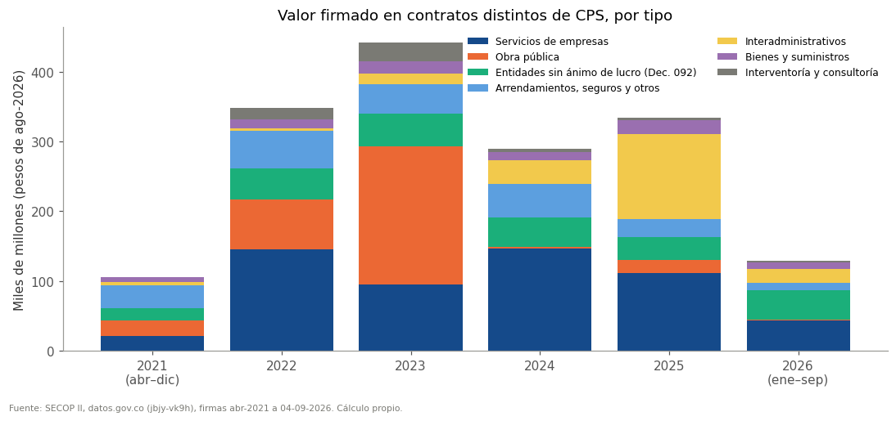

> **Qué no significa:** No mide obra terminada ni pagada, y una sola licitación grande mueve el año. No indica uso electoral.

Patrón estadístico · publicable con cautela · universo: Contratos válidos de la Alcaldía central distintos de CPS · límite: Valor firmado; un periodo de gobierno por lado (no permite generalizar). 2026 es parcial. · tabla: p22_la_obra_publica_se_firmo_sobre_todo_al_f.csv

### ¿Cómo contrata la Alcaldía lo que no son personas?

**Más contratación directa con entidades públicas.** En los contratos distintos de CPS, la contratación directa pesó 6 % del valor en 2022 y 11 % en 2023, y subió a 41 % en 2025. El aumento viene sobre todo de contratos y convenios interadministrativos (36 % del valor en 2025), firmados con entidades y empresas públicas. Entre las empresas y consorcios, los 10 proveedores con más valor reúnen el 39 % del total desde abril de 2021 y los consorcios o uniones temporales, el 34 %.

> **Qué no significa:** Contratar directamente con otra entidad pública es legal. No se evalúa si cada contrato cumplió los requisitos.

Dato descriptivo · publicable con cautela · universo: Contratos válidos de la Alcaldía central distintos de CPS · límite: SECOP llama 'valor cero' a una categoría de interadministrativos que sí tiene valor; se usa la justificación registrada. · tabla: p23_mas_contratacion_directa_con_entidades_p.csv

## Acto 7 · Lo que no salta a la vista

Hallazgos que solo aparecen al seguir a las personas año tras año, y los límites de los datos.

### ¿Cuántos contratos firma una persona en un año?

**Un año, uno o dos contratos.** En los años completos, entre 48 % y 63 % de las personas firmó un solo CPS en el año, y entre 3 % y 15 % firmó tres o más. Un CPS empieza típicamente 2 a 3 días después de firmado. Hubo entre 54 y 315 contratos de menos de un mes por año, y SECOP registra 1 CPS con inicio anterior a la firma (posible error de registro).

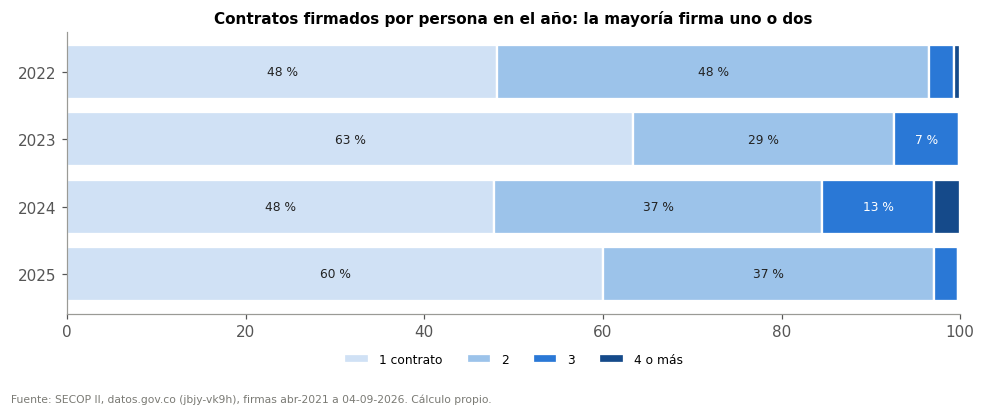

> **Qué no significa:** Firmar varios contratos en un año no es irregular; tampoco lo es un contrato de menos de un mes.

Dato descriptivo · publicable · universo: CPS de personas, Alcaldía central, años completos · límite: Fechas registradas en SECOP II. · tabla: p24_un_ano_uno_o_dos_contratos.csv

### ¿Hay un núcleo de personas que siempre está?

**Un núcleo pequeño atraviesa los dos gobiernos.** De las 3.548 personas con CPS en 2022, 525 (15 %) firmaron al menos un CPS en cada año hasta 2025, cruzando el cambio de gobierno. 285 personas tuvieron CPS en todos los años observados, de 2021 a 2026.

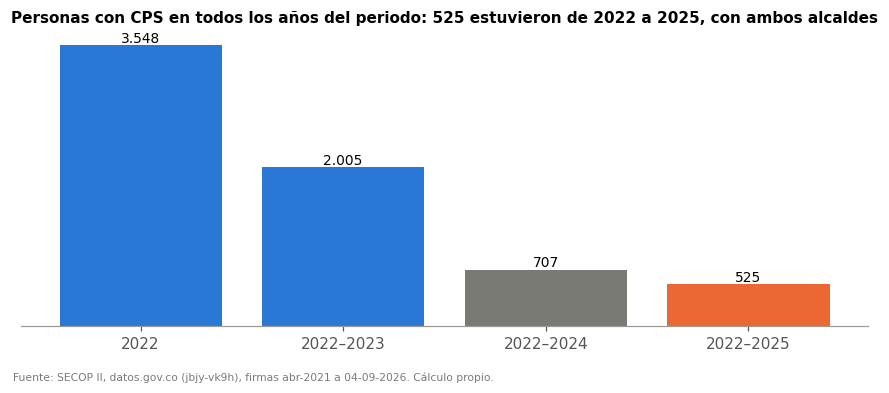

> **Qué no significa:** Estar en todos los años no es favoritismo: puede reflejar experiencia o servicios permanentes. Tampoco es un empleo de planta.

Dato descriptivo · publicable · universo: CPS de personas, Alcaldía central · límite: Solo ve la Alcaldía central. · tabla: p25_un_nucleo_pequeno_atraviesa_los_dos_gobi.csv

### ¿De dónde salen estos datos y qué tan completos son?

**Datos públicos con huecos conocidos.** La consulta a SECOP I no se pudo hacer en esta ejecución (sin conexión), así que el paso de SECOP I a SECOP II en abril de 2021 no quedó verificado aquí; el análisis empieza en abril de 2021, primer mes con registro pleno en SECOP II. La lista de otras entidades de la ciudad en SECOP II no se pudo consultar en esta ejecución. El valor pagado aparece en 94 % de los CPS de 2022 pero en 60 % de los de 2026, que siguen en ejecución: por eso se usa el valor pactado. La clasificación profesional / apoyo a la gestión sale del objeto del contrato; cuando el objeto dice ambas cosas se usa la profesión u oficio nombrado (ingeniero, arquitecto, técnico, auxiliar…). Donde la etiqueta literal y la profesión existen a la vez, coinciden en el 98 % o más de los casos. Quedó ambiguo entre el 0,2 % y el 1,0 % de los CPS según el año.

> **Qué no significa:** La base no es un registro de nómina ni de pagos. El estado 'terminado' de SECOP depende de la antigüedad del contrato, no de cómo terminó.

Dato descriptivo · publicable · universo: Corrida congelada de SECOP II y verificaciones del 01 · límite: Las verificaciones externas dependen de la conexión al ejecutar el 01. · tabla: p26_datos_publicos_con_huecos_conocidos.csv

## Preguntas que solo los expedientes pueden responder

Los datos muestran situaciones que merecen explicación, pero SECOP no basta para concluir. Se publican como preguntas, sin cifras:

1. **¿Con qué excepción legal y en qué fecha real se suscribieron los CPS con fecha de firma dentro de la Ley de Garantías de 2022 (P16)?** Se resuelve con los expedientes: fecha de suscripción física, causal de contratación directa y excepción del art. 33 invocada.
2. **¿Los contratos interadministrativos firmados durante la restricción de 2025–2026 ejecutan recursos, y cómo se ajustan al art. 38 de la Ley 996 (P18)?** Se resuelve con los expedientes, los estudios previos y el concepto jurídico de la Alcaldía.
3. **¿Alguna prórroga de los contratos de enero de 2026 se usó para suplir contratación nueva durante la restricción (P15)?** Se resuelve con los estudios previos de cada prórroga y su justificación.
4. **¿Cuáles son los valores mensuales más altos?** Por qué aún no se concluye: Un extremo puede ser error de registro, objeto distinto o forma de pago; revisar expediente antes de nombrar.
5. **¿Hay personas con CPS simultáneos en varias entidades?** Por qué aún no se concluye: No prueba incompatibilidad: la simultaneidad formal no dice nada de horarios ni de dedicación; requiere expedientes.
6. **¿Qué pasa con los contratos de personas en la ESE?** Por qué aún no se concluye: No se confirman como CPS ni se suman a la Alcaldía; la ESE aparece en SECOP II desde jul-2022.

## Prueba de estrés: ¿se caen las conclusiones?

Cada conclusión principal se recalculó con supuestos alternativos. Esto es lo que pasa:

| Indicador | Resultado | Si se cambia a… | Resultado alternativo | ¿Se mantiene? |
|---|---|---|---|---|
| % personas con 7+ meses de contrato (2023 / 2025) | 39 % / 28 % | Sin los días de prórroga | 37 % / 26 % | Se mantiene: 2023 por encima de 2025 |
| Espera mediana entre contratos (días) | 47 | Seguimiento de 180 días | 36 | Cambia con el seguimiento: se publica el de 365 días, igual para todos |
| Diferencia entre gobiernos en % renovado antes de 90 días | no se publica | Rango entre años de terminación | 40 % a 75 % | No se compara a los gobiernos: el año pesa más que el gobierno |
| Mediana real profesional 2021 → 2026 (millones) | 5,11 → 4,23 | Solo contratos de 90 días o más | 5,11 → 4,23 | Se mantiene: erosión real con el tiempo |
| Cambio de la mediana real de apoyo 2021 → 2026 | -9,7 % | Contando los ambiguos como apoyo | -9,7 % | Se mantiene la dirección |
| Cambio real mediano, misma persona profesional | +0,7 % | Misma persona, ene–ago 2022 vs 2026 (cuaderno 04) | -12,6 % | Cambia según el diseño: no se atribuye a un gobierno |
| % de contratistas de la Alcaldía con CPS en otra entidad | 15 % | Sumando registros por revisar de la ESE | 19 % | Se mantiene el orden de magnitud |
| % de personas de 2023 que siguen en 2024 | 30 % | CPS en cualquiera de las nueve entidades | 33 % | Se mantiene: muy por debajo de la continuidad dentro de un gobierno (≥57 %) |
| Obra 2023 vs 2024 (miles de millones reales) | 198,4 vs 3,2 | Sin el contrato de obra más grande de cada año | 167,1 vs 1,8 | Se mantiene: 2023 muy por encima de 2024 |
| Cambio en personas con CPS, año 3 | +10,8 % | Rango en las tres ventanas del cuaderno 04 | +10,8 % a +26,5 % | Se mantiene la dirección; se publica el rango, no una cifra |
| Cambio en CPS firmados, año 3 | +22,4 % | Rango en las tres ventanas del cuaderno 04 | +22,4 % a +25,4 % | Se mantiene la dirección; se publica el rango, no una cifra |

## Lo que estos datos no permiten afirmar

- Que las tandas de firma o las prórrogas antes de elecciones tengan fines electorales: SECOP muestra fechas, no intenciones.
- Que quien no fue recontratado haya sido despedido o perseguido, o que quien repite sea favorecido.
- Que la caída de los honorarios reales sea decisión de un gobierno: empezó antes del cambio y la clasificación de subtipo no está validada.
- Que el valor mensual equivalente sea un salario o que la vigencia del contrato sean días trabajados.
- Que el Concejo, la Personería, la Contraloría o el Hospital Regional contraten por cuenta del alcalde.
- El sexo, la edad, la profesión o el barrio de los contratistas: SECOP II no los registra.
- Los CPS son empleos o el valor mensual es un salario: SECOP registra contratos y valores pactados, no pagos ni relación laboral.
- Un gobierno pagó menos a los profesionales: La caída real empieza antes del cambio de gobierno (Q06).
- Un gobierno generó más continuidad o más empleo: Las cifras cambian según la ventana y la etapa del mandato.
- Dos contratos simultáneos prueban ilegalidad: Hay que revisar dedicación, obligaciones y pagos.
- Las firmas en Ley de Garantías fueron ilegales: Puede haber excepciones y diferencias entre firma electrónica y suscripción.
- Recurrencia de personas o empresas prueba favoritismo: Es un patrón descriptivo con explicaciones alternativas.
- El Concejo o los órganos de control son contratación del alcalde: Son entidades autónomas; se analizan separadas.
- ¿Cuánto se espera hasta el siguiente contrato, según el gobierno? — Ventana de 8 meses con Ley de Garantías y censura; el resultado depende del año y no del gobierno.
- ¿Pagó menos Jonathan a los profesionales que Alfonso? — Contrastar ventanas separadas cuatro años confunde tendencia inflacionaria con decisión de gobierno.
- ¿Qué profesiones ofrecen más estabilidad? — Requiere otra fuente (hojas de vida, SIGEP).

## Epílogo · Cómo se hizo esta historia

**1. El origen.** Todo sale de SECOP II, el sistema público donde las entidades colombianas publican sus contratos. Se descargó por la API de datos abiertos (datos.gov.co, conjunto jbjy-vk9h) una sola vez, con corte al 4 de septiembre de 2026, y el archivo se congeló con una huella digital (sha256): nunca se modifica, y cualquiera puede repetir el análisis sobre exactamente los mismos datos.

**2. La limpieza (cuadernos 01 y 02).** Se separaron las nueve entidades por su NIT, se descartaron duplicados y contratos con estados inválidos, se identificó a cada persona por su documento y se distinguieron personas naturales, empresas y consorcios. Las fechas se midieron con duración inclusiva y se comprobó con los propios datos que la fecha final ya incluye las prórrogas.

**3. ¿Qué es un CPS? (cuaderno 03).** Un contrato cuenta como CPS si el tipo, la modalidad y el objeto lo indican y el contratista es una persona natural. El objeto permite separar profesional y apoyo a la gestión; si dice ambas cosas, decide la profesión u oficio nombrado (como arquitecto, como técnico). Esa clasificación coincide con la profesión nombrada en el 98 % de los casos verificables, pero está sin validación manual y trae una plantilla para revisarla a mano.

**4. Comparar con justicia (cuaderno 04).** Los valores se llevan a pesos constantes con el IPC del DANE y los gobiernos se comparan en ventanas de la misma etapa del mandato. Cada comparación se repite en varias ventanas y recibe un dictamen de robustez.

**5. Seguir a las personas (cuaderno 05).** Los contratos de una persona se unen en episodios para medir continuidad, pausas y contratos simultáneos, y se cruzan con los periodos de la Ley de Garantías.

**6. Decidir qué se publica (cuadernos 06 y 07).** Cada hallazgo recibe un estado por reglas: publicable, con cautela, solo la dirección, solo para investigar o no publicable. Esta historia solo cuenta los tres primeros.

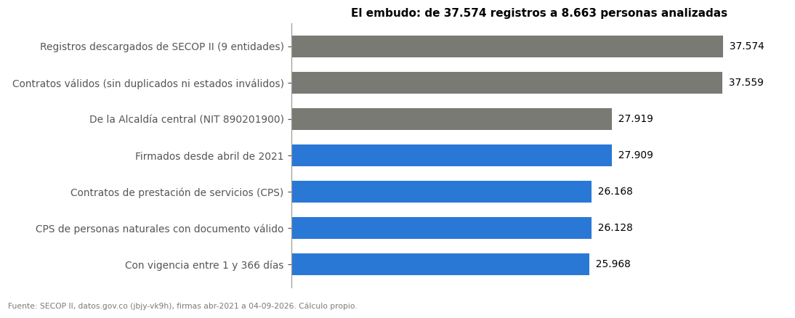

### Las decisiones y por qué

| Decisión | Alternativa descartada | Por qué |
|---|---|---|
| La Alcaldía se identifica por su NIT (890201900) | Filtrar por ciudad | La ciudad mezcla entidades autónomas (Concejo, Contraloría) con la Alcaldía. |
| Cada entidad por separado; nada se suma al alcalde automáticamente | Sumar todo lo de Barrancabermeja | El Concejo y los órganos de control no dependen del alcalde. |
| La persona es su número de documento | Usar el nombre | Los nombres cambian de escritura; el documento no. |
| El análisis empieza en abril de 2021 | Empezar en enero de 2021 | Es el primer mes con registro pleno en SECOP II; la verificación con SECOP I la hace el 01 cuando tiene conexión y en esta ejecución no se pudo. |
| Comparar alcaldes solo en la ventana principal (ene–ago del año 3) | Comparar gobiernos completos o el año 2 | Es la única ventana en la misma etapa del mandato con cobertura completa en SECOP II. |
| Duración inclusiva (fin − inicio + 1) | Restar fechas sin más | Restar pierde un día por contrato y subestima la cobertura. |
| No sumar los días adicionados a la fecha final | Sumarlos | La prueba del 02 muestra que la fecha final ya los incluye. |
| Pesos constantes con el IPC del DANE | Pesos de cada año | Entre 2021 y 2026 la inflación cambia el poder de compra; se muestran ambas. |
| Seguimiento igual de 365 días para medir renovaciones, por año de terminación | Medir todas las esperas y agrupar por gobierno | El periodo más reciente tiene menos tiempo para mostrar esperas largas (sesgo de censura) y el año electoral pesa más que el gobierno. |
| Publicar conteos con fecha de firma en periodos de Ley de Garantías como dato, no como infracción | Callarlos o presentarlos como ilegales | El conteo es un hecho verificable; la legalidad depende de excepciones y expedientes. |
| Valor pactado, no pagado | Valor pagado | El pagado falta en contratos en ejecución. |
| No imputar datos faltantes | Rellenar con promedios | Rellenar inventa información. |
| Desempatar el subtipo por la profesión u oficio nombrado en el objeto | Dejar ambiguos los objetos que dicen 'profesionales y de apoyo' | El rol nombrado (arquitecto, técnico, auxiliar) es evidencia directa; la regla coincide con la etiqueta literal en más del 98 % de los casos. |
| Estados de publicación por reglas | Publicar todo | Evita convertir una coincidencia en acusación. |

### Las herramientas

Python con pocas librerías, para que cualquiera pueda repetirlo. Cada cuaderno se ejecuta con Run All, verifica las huellas de la etapa anterior y deja un manifiesto con las huellas de lo que produce. Dos ejecuciones completas dan datos, tablas y gráficas idénticos byte a byte; solo cambian la hora y el entorno anotados en los manifiestos.

| Librería | Versión | Para qué |
|---|---|---|
| pandas | 2.3.3 | Leer, limpiar, unir y resumir tablas. |
| numpy | 2.2.6 | Cálculos vectorizados: series diarias, percentiles, Gini. |
| matplotlib | 3.10.9 | Todas las gráficas. |
| openpyxl | (la que tenga instalada) | Leer el anexo del IPC del DANE (cuaderno 04). |
| pathlib, json, hashlib | biblioteca estándar | Rutas relativas, manifiestos y huellas sha256 de cada archivo. |
| urllib | biblioteca estándar | Descarga desde la API de datos.gov.co y verificaciones externas (cuaderno 01). |
| re, unicodedata | biblioteca estándar | Normalizar textos y reconocer tipos de contrato y dependencias. |
| IPython.display | Jupyter | Mostrar tablas, gráficas y texto en el cuaderno. |

### Cómo se contó

La historia sigue técnicas actuales de narrativa con datos: una gran idea en una frase; tres momentos (contexto, tensión y lo que significa); títulos de gráfica que ya dicen la conclusión; una sola cosa resaltada por gráfica; una persona compuesta para volver humanas las medianas; y, por honestidad, un 'qué no significa' en cada hallazgo y una prueba de estrés al final.

## Fuentes

- [SECOP II · Contratos electrónicos (datos.gov.co, jbjy-vk9h)](https://www.datos.gov.co/Gastos-Gubernamentales/SECOP-II-Contratos-Electr-nicos/jbjy-vk9h)
- [DANE · Índice de precios al consumidor (IPC)](https://www.dane.gov.co/index.php/estadisticas-por-tema/precios-y-inflacion/indice-de-precios-al-consumidor-ipc)
- [Ley de Garantías · presidencial_2022](https://www.infobae.com/america/colombia/2022/01/26/ley-de-garantias-entra-en-funcionamiento-este-sabado-29-de-enero-le-explicamos-en-que-consiste/)
- [Ley de Garantías · territorial_2023](https://www.eltiempo.com/politica/gobierno/ley-de-garantias-cuales-son-las-restricciones-por-elecciones-regionales-782201)
- [Ley de Garantías · territorial_art38_2026](https://www.colombiacompra.gov.co/wp-content/uploads/2025/10/Circular-006-ABC-de-Ley-de-Garantias-Dig.pdf)
- [Ley de Garantías · presidencial_2026](https://www.colombiacompra.gov.co/wp-content/uploads/2025/10/Circular-006-ABC-de-Ley-de-Garantias-Dig.pdf)
- [Salario mínimo 2026 · Decreto 1469 de 2025](https://www.alcaldiabogota.gov.co/sisjur//normas/Norma1.jsp?i=191925)
- [Salario mínimo 2026 · Decreto transitorio 0159 de 2026](https://chapmanwilches.com/en/gobierno-nacional-fija-el-salario-minimo-mensual-transitorio-para-2026-en-1-750-905-decreto-0159-de-2026-del-ministerio-del-trabajo/)
- [Registraduría · segunda vuelta presidencial del 21 de junio de 2026](https://www.registraduria.gov.co/Se-cerraron-las-urnas-de-la-segunda-vuelta-de-las-elecciones-presidenciales.html)
